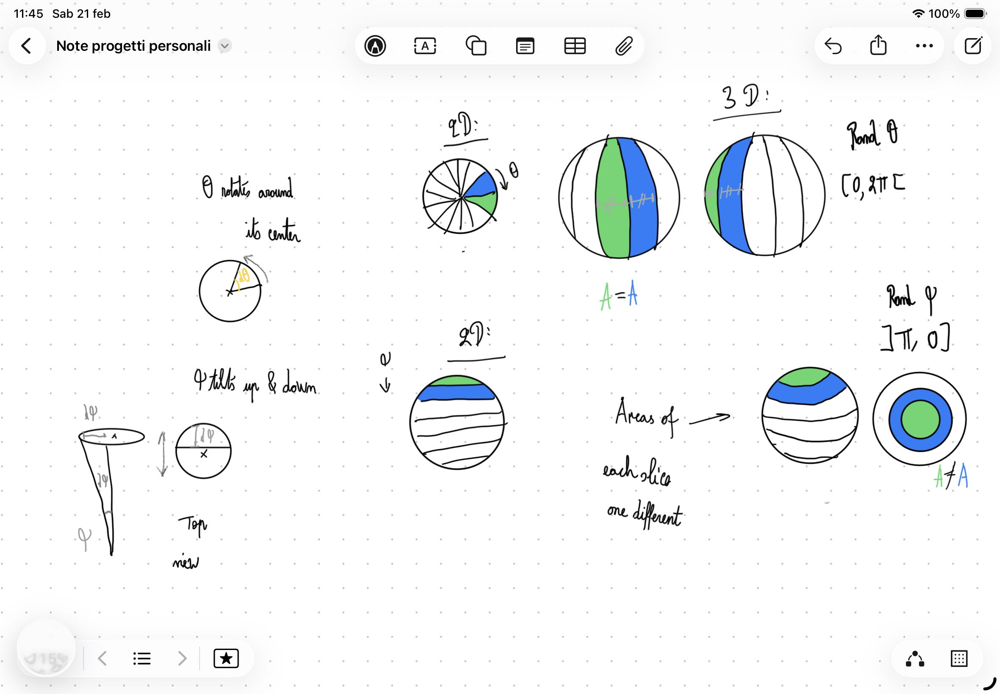

# Uniform Sphere Sampling

## Goal

Generate random points uniformly distributed across the volume of a spherical shell (between `ρ_min` and `ρ_max`). "Uniformly" means every unit of volume has the same probability of containing a point — no clustering anywhere.

Three values need to be sampled:

| Variable  | Name            | Range          | Role                                        |
| --------- | --------------- | -------------- | ------------------------------------------- |
| θ (theta) | Azimuthal angle | [0, 2π[        | Horizontal rotation around the z-axis       |
| φ (phi)   | Polar angle     | [0, π]         | Vertical angle from the north pole (z-axis) |
| ρ (rho)   | Radius          | [ρ_min, ρ_max] | Distance from the origin                    |

## Spherical Coordinates → Cartesian

From the right triangle formed by ρ, the xy-plane radius `r`, and the z coordinate:

```text
r = ρ sin(φ)          (xy-plane radius)

x = ρ sin(φ) cos(θ)
y = ρ sin(φ) sin(θ)
z = ρ cos(φ)
```

---

## 1. Azimuthal Angle θ — Uniform Sampling Works

The sphere has **rotational symmetry** around the z-axis. Looking down from above, every direction looks identical. Slicing by θ produces identical wedges from pole to pole.

Equal Δθ → equal surface area → **uniform sampling is correct**.

**Pizza analogy:** Think of slicing a pizza. Each cut goes from the center outward, rotating by Δθ. Because every cut starts from the same center point and sweeps the same angle, every slice covers the same area. θ works the same way — every wedge from pole to pole is identical.

```text
θ = 2πu    where u ∈ [0, 1)
```

---

## 2. Radius ρ — Volume-Uniform Sampling

Naive approach: `ρ = ρ_min + u × (ρ_max - ρ_min)` — **wrong**. This clusters points near the center because larger shells contain more volume.

The volume of a sphere is:

```text
V = (4π/3) × ρ³
```

Volume scales with ρ³, so we need to sample ρ³ uniformly, then take the cube root.

### Derivation

We want the cumulative distribution function (CDF) to be proportional to volume:

```text
P(radius ≤ ρ) = (ρ³ - ρ_min³) / (ρ_max³ - ρ_min³)
```

Setting this equal to `u` (uniform in [0, 1]) and solving for ρ:

```text
u = (ρ³ - ρ_min³) / (ρ_max³ - ρ_min³)

ρ³ = ρ_min³ + u × (ρ_max³ - ρ_min³)

ρ = ∛(ρ_min³ + u × (ρ_max³ - ρ_min³))
```

The `4π/3` factor cancels out in the ratio — it appears in both numerator and denominator.

---

## 3. Polar Angle φ — The Clustering Problem

### The Problem

Naive approach: `φ = πu` — **wrong**. This produces visible clustering at the poles (z-axis).

Why? The sphere is **NOT symmetric along the z-axis** the way it is around it.

At different φ values, the "ring" (circle of latitude) has different circumferences:

- At the equator (φ = π/2): circumference = `2πr` (maximum)
- Near a pole (φ ≈ 0): circumference ≈ `0` (tiny)

Equal Δφ steps produce bands of **unequal surface area**. Bands near the poles cover much less area than bands near the equator. But uniform φ sampling assigns them equal probability → too many points end up near the poles.

**Tomato analogy:** With φ, imagine making horizontal cuts across the sphere — like slicing a tomato into discs. The disc at the equator (φ = π/2) is large. The disc near a pole (φ ≈ 0) is tiny. Equal Δφ steps produce bands of wildly different sizes, so uniform φ sampling floods the poles with points.



### The Surface Area Element

The surface area of a thin band on a sphere is:

```text
dA = ρ² sin(φ) dφ dθ
```

The `sin(φ)` factor is the problem — it makes the area depend on φ.

### The Key Insight

Notice that `sin(φ) dφ` is the negative derivative of `cos(φ)`:

```text
d(cos(φ)) = -sin(φ) dφ

→ sin(φ) dφ = -d(cos(φ))
```

Substituting into the surface area element:

```text
dA = ρ² × (-d(cos(φ))) × dθ
```

**The surface area is uniform in cos(φ), not in φ.**

This means: if we sample `cos(φ)` uniformly instead of φ, each infinitesimal band will have equal surface area.

### The Formula

`cos(φ)` ranges from:

- `cos(0) = 1` (north pole, φ = 0)
- `cos(π) = -1` (south pole, φ = π)

So we need a uniform random value in `[-1, 1]`.

Mapping `u ∈ [0, 1]` to `[1, -1]`:

```text
cos(φ) = 1 - 2u

φ = acos(1 - 2u)
```

Note: `acos` always returns values in `[0, π]`, which is exactly the range we need for φ.

---

## Summary

- **θ** — sample uniformly: `θ = 2πu` (rotational symmetry makes this correct as-is)
- **ρ** — sample ρ³ uniformly: `ρ = ∛(ρ_min³ + u(ρ_max³ - ρ_min³))`
- **φ** — sample cos(φ) uniformly: `φ = acos(1 - 2u)`

### Why θ Works but φ Doesn't

It comes down to **symmetry**. The sphere is rotationally symmetric around the z-axis (θ's axis of rotation), so every θ-slice is identical. But the cross-section changes as φ sweeps from pole to equator to pole — the rings get bigger then smaller. That asymmetry is what `sin(φ)` captures, and what the `acos(1 - 2u)` fix compensates for.

### The General Technique

This is the **inverse CDF method**: find the variable where the distribution is already uniform (here, `cos(φ)`), then sample that variable uniformly. It's the same technique used for ρ — volume scales with ρ³, so we sample ρ³ uniformly and take the cube root.
