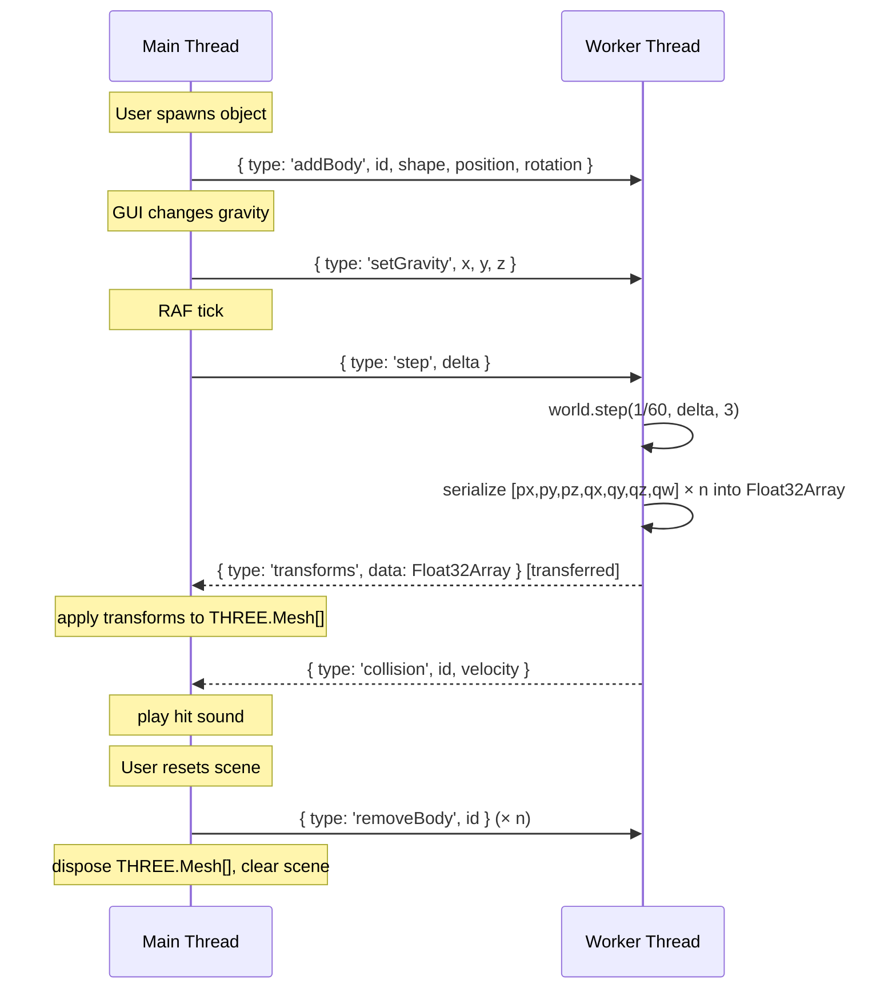

# Physics Web Worker

## Part 1 — The event-driven / message-passing model

### 1.1 The model itself

Two (or more) isolated contexts — each owning their own state, unable to directly touch each other's memory — coordinate exclusively by sending messages.

|                    |                                                                                                                                 |
| ------------------ | ------------------------------------------------------------------------------------------------------------------------------- |
| **What it is**     | Isolated state on each side; messages are the only channel between them                                                         |
| **What it does**   | Keeps contexts decoupled: neither side needs to know *how* the other works, only *what* to send                                 |
| **How it works**   | Sender emits → transport carries → receiver reacts. Inherently async; the sender does not block                                 |
| **Why it matters** | No shared mutable state means no race conditions by design. The same pattern scales from a browser tab to a distributed cluster |

This model is not a niche pattern — it shows up everywhere:

| API / System         | Transport                                          |
| -------------------- | -------------------------------------------------- |
| WebSockets           | Browser ↔ server, over the network                 |
| Broadcast Channel    | Same-origin tabs and workers, in-browser           |
| WebRTC Data Channel  | Peer-to-peer, direct between browsers              |
| Web Workers          | Main thread ↔ worker, same process                 |
| Game engines         | Physics thread ↔ render thread, shared process     |
| Message queues       | Service ↔ service (Kafka, RabbitMQ, Redis pub/sub) |
| Actor model runtimes | Process ↔ process (Erlang, Akka)                   |

> Redux `dispatch` → reducer is the same idea collapsed into a single thread. No transport needed, but the mental model — isolated state, commands as the only mutation path — is identical.

---

### 1.2 Web Workers

A Web Worker is a background JavaScript thread. It has no access to the DOM, no `window`, no `document`. It runs in a completely separate execution context from the main thread, the browser thread.

Communication is done exclusively via `postMessage` and `onmessage`:

```ts
// main.ts
const worker = new Worker(new URL('./physics.worker.ts', import.meta.url), { type: 'module' });

worker.postMessage({ type: 'step', delta: 0.016 });

worker.onmessage = ({ data }) => {
  // data is a copy (or transferred ownership) of what the worker sent
  switch (data.type) {

    case 'transforms': {
      world.step(1 / 60, data.delta, 3);

      // ...send results back
      self.postMessage({
        type: 'transforms',
        payload: Float32Array
      });
      break
    };

   default:
      console.warn('Unknown message type:', data.type);
  }
};
```

```ts
// physics.worker.ts
self.onmessage = ({ data }) => {
  switch (data.type) {
    case 'step': {
      world.step(1 / 60, data.delta, 3);

      // ...send results back
      self.postMessage({
        type: 'transforms',
        payload: Float32Array
      });
      break
    };

    default:
      console.warn('Unknown message type:', data.type);
  }
};
```

**Transferable objects** — by default `postMessage` deep-copies the data (structured clone). For large buffers sent every frame this is expensive. Transferables avoid the copy by *transferring ownership* of the underlying `ArrayBuffer` to the receiver — the sender can no longer read it:

```ts
const buffer = new Float32Array(bodyCount * 7); // [px, py, pz, qx, qy, qz, qw] per body
self.postMessage({ type: 'transforms', data: buffer }, [buffer.buffer]);
//                                                      ^^^^^^^^^^^^^ transfers ownership
```

**Why bother for physics?**
`world.step()` is pure CPU arithmetic. It has no side effects outside Cannon's own state.
Offloading it to a worker gives that CPU time back to the main thread — meaning the RAF loop can spend its full budget on rendering instead of competing with physics calculations. The trade-off: `postMessage` adds a small latency per frame. For a small scene this is likely imperceptible; it matters once body counts get high.

---

## Part 2 — Our current architecture and the problems

### 2.1 Current design

The physics simulation and the Three.js rendering are tightly coupled on the **main thread**:

- `PhysicsObject` ([src/utils/classes/physics-object.ts](../src/utils/classes/physics-object.ts)) holds both a `THREE.Mesh` and a `CANNON.Body` on the same instance. `sync()` copies body transforms to the mesh every frame.
- `world.step()` is called inside the RAF animate loop in [src/components/ThreeScene/ThreeScene.tsx](../src/components/ThreeScene/ThreeScene.tsx) — same thread, same tick as `renderer.render()`.
- Collision sounds are created as `HTMLAudioElement` instances inside `onCollision`, which is an event listener registered directly on the `CANNON.Body`.
- `physicsOptions` (gravity) is a plain module-level object mutated directly by lil-gui. `shitpostMode` is module-level state in `physics-object.ts`.

### 2.2 Why this breaks with a worker

| Problem                                              | Why it matters                                                                                                                                                                                |
| ---------------------------------------------------- | --------------------------------------------------------------------------------------------------------------------------------------------------------------------------------------------- |
| `CANNON.World` and `CANNON.Body` are class instances | They can't cross `postMessage` — structured clone doesn't know how to serialise them. The worker must create and own its own `World` and bodies.                                              |
| `PhysicsObject` couples `THREE.Mesh` + `CANNON.Body` | A worker has no Three.js context. The class needs to split: body management lives in the worker, mesh management stays on main.                                                               |
| `HTMLAudioElement` is main-thread only               | The `onCollision` listener runs where the body lives — inside the worker. It can't create audio there. Collision events need to be `postMessage`d back to the main thread for audio playback. |
| lil-gui mutates `physicsOptions` directly            | There's no shared object across threads. Gravity changes become commands: `postMessage({ type: 'setGravity', x, y, z })`.                                                                     |
| `shitpostMode` is module-level state                 | Each thread has its own module scope. The toggle needs to be forwarded to the worker as a message too.                                                                                        |

---

## Part 3 — Target architecture



### Message payload shapes

```ts
// Main → Worker
type WorkerInbound =
  | { type: 'addBody';    id: string; shape: 'sphere' | 'box'; position: Vec3Like; rotation?: Vec3Like; dimensions?: Vec3Like; radius?: number }
  | { type: 'removeBody'; id: string }
  | { type: 'setGravity'; x: number; y: number; z: number }
  | { type: 'setShitpostMode'; value: boolean }
  | { type: 'step';       delta: number };

// Worker → Main
type WorkerOutbound =
  | { type: 'transforms'; data: Float32Array } // [px, py, pz, qx, qy, qz, qw] × bodyCount, in insertion order
  | { type: 'collision';  id: string; velocity: number };
```

The `transforms` message uses a flat `Float32Array` (7 floats per body) transferred with ownership — no copy, no GC pressure, same approach used by game engines for their physics → render data handoff.
